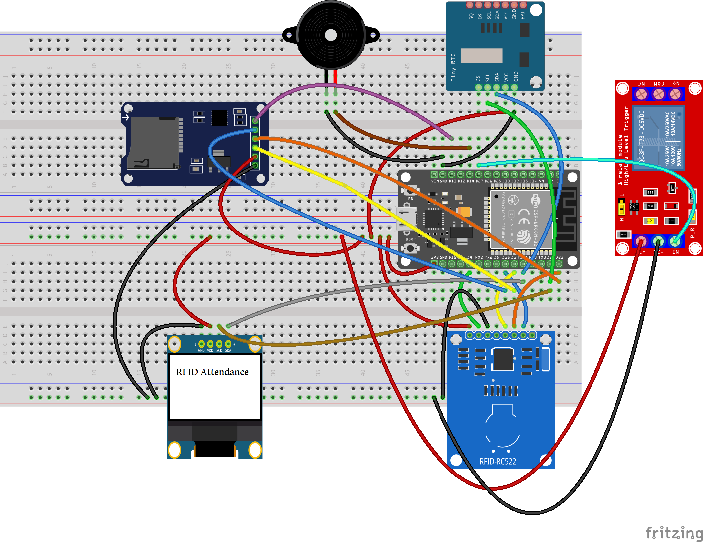
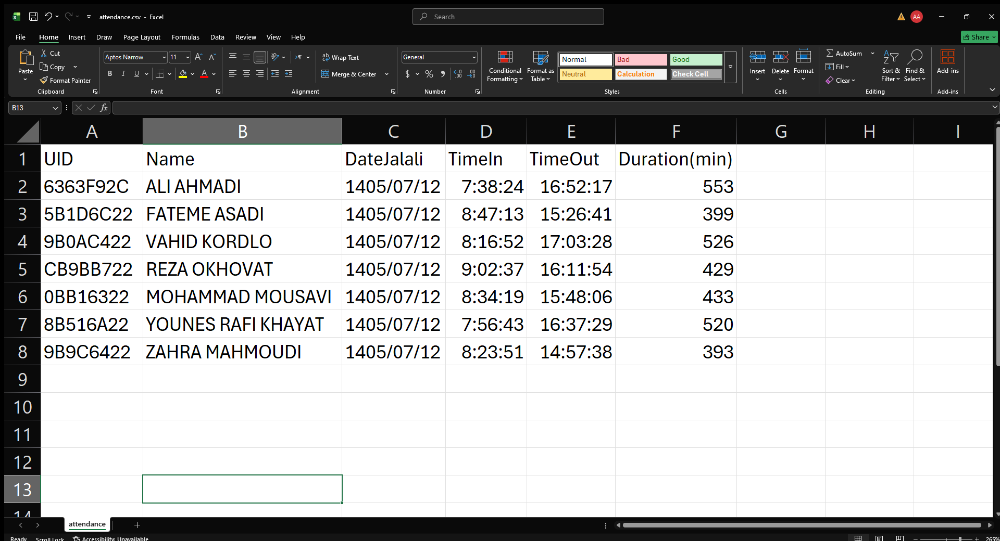

# ESP32 RFID Attendance System

A complete RFID-based attendance and access-control system built around the **ESP32**.

The system combines RFID identification, time-based access control, real-time clock synchronization, OLED user feedback, relay control, local SD-card backup, Wi-Fi connectivity, a PHP server with CSV storage, persistent attendance states, and browser-based OTA firmware updates.

The project was designed not only as an attendance system, but also as a practical embedded-systems project involving **microcontrollers, SPI/I2C peripherals, networking, file storage, web communication, hardware interfacing, and real-world debugging**.

---

## Features

- RFID card identification using MFRC522
- Individual user identification using RFID UID
- Time-based access control for each registered user
- Check-in / Check-out attendance logic
- Real-time clock using DS1307
- Automatic time synchronization using NTP
- Jalali (Persian) date support
- 0.96" 128×64 OLED display
- Relay-controlled access mechanism
- Buzzer feedback
- Persistent attendance state using ESP32 Preferences
- Local attendance backup on microSD card
- Wi-Fi connectivity
- HTTP communication with a PHP backend
- CSV-based server-side attendance database
- Multiple attendance sessions per day
- Browser-based OTA firmware update
- Web interface for firmware upload
- Automatic ESP32 restart after OTA update
- Shared SPI bus between RFID and SD card
- Hardware-level troubleshooting and SPI conflict debugging

---

# System Architecture

```text
                         ┌──────────────────────┐
                         │      ESP32           │
                         │                      │
                         │  Main Controller     │
                         └──────────┬───────────┘
                                    │
          ┌─────────────────────────┼─────────────────────────┐
          │                         │                         │
          ▼                         ▼                         ▼
   ┌─────────────┐           ┌─────────────┐           ┌─────────────┐
   │   MFRC522   │           │   DS1307    │           │   OLED      │
   │ RFID Reader │           │     RTC     │           │  SSD1306    │
   │    SPI      │           │    I2C      │           │    I2C      │
   └─────────────┘           └─────────────┘           └─────────────┘
          │
          │
          ▼
   ┌─────────────┐
   │    RFID     │
   │     UID     │
   └─────────────┘

          ESP32
            │
            ├──────────────► Buzzer
            │
            │
            ▼
     ┌──────────────┐
     │ Logic Level  │
     │   Shifter    │
     └──────┬───────┘
            │
            ▼
      ┌───────────┐
      │  5V Relay │
      └───────────┘

            ESP32
              │
              │ Wi-Fi
              ▼
       ┌─────────────┐
       │ PHP Server  │
       │  Apache     │
       └──────┬──────┘
              │
              ▼
       ┌─────────────┐
       │ attendance  │
       │    .csv     │
       └─────────────┘

            ESP32
              │
              ▼
       ┌─────────────┐
       │   microSD   │
       │ Local Backup│
       └─────────────┘
```
Hardware
Main Components

| Component           | Purpose                           | Interface |
| ------------------- | --------------------------------- | --------- |
| ESP32               | Main microcontroller              | —         |
| MFRC522             | RFID card reader                  | SPI       |
| DS1307              | Real-time clock                   | I2C       |
| SSD1306 128×64 OLED | User interface                    | I2C       |
| 3.3V microSD module | Local attendance backup           | SPI       |
| 5V Relay Module     | Access/lock control               | GPIO      |
| Logic Level Shifter | 3.3V → 5V relay signal conversion | Digital   |
| Buzzer              | Audio feedback                    | GPIO      |

Pin Configuration
RFID — MFRC522

| MFRC522  |   ESP32 |
| -------- | ------: |
| SDA / SS |  GPIO 5 |
| SCK      | GPIO 18 |
| MOSI     | GPIO 23 |
| MISO     | GPIO 19 |
| RST      |  GPIO 4 |
| 3.3V     |    3.3V |
| GND      |     GND |

DS1307 RTC

| DS1307 |         ESP32 |
| ------ | ------------: |
| SDA    |       GPIO 21 |
| SCL    |       GPIO 22 |
| VCC    | Module supply |
| GND    |           GND |

SSD1306 OLED

| OLED    |   ESP32 |
| ------- | ------: |
| SDA     | GPIO 21 |
| SCL     | GPIO 22 |
| Address |    0x3C |
The OLED and DS1307 share the same I2C bus.

## microSD

The working microSD module uses the same SPI bus as the MFRC522 RFID reader.

| microSD |   ESP32 |
| ------- | ------: |
| SCK     | GPIO 18 |
| MISO    | GPIO 19 |
| MOSI    | GPIO 23 |
| CS      | GPIO 13 |
| VCC     |    3.3V |
| GND     |     GND |

The RFID reader and SD card share:

• SCK
• MISO
• MOSI

but use separate chip-select pins:

• RFID CS → GPIO 5
• SD CS → GPIO 13

The firmware explicitly manages the chip-select lines to prevent conflicts between the two SPI devices.

## Relay

The project uses a 5V relay module.

Since the ESP32 GPIO operates at 3.3V while the relay module requires a 5V-level control signal, a logic level shifter was used between the ESP32 and the relay input.

```text
ESP32 GPIO 27
      │
      ▼
┌───────────────┐
│ Logic Level   │
│   Shifter     │
└───────┬───────┘
        │
        ▼
   5V Relay Module
```

   This allows the 3.3V ESP32 control signal to interface with the 5V relay module.

The relay is configured as active-low:

• LOW → Relay ON
• HIGH → Relay OFF

The relay is activated for different durations depending on the attendance event.

## RFID Users

The firmware contains a UID-to-user mapping.

Example registered users:

| RFID UID   | User               |
| ---------- | ------------------ |
| `6363F92C` | ALI AHMADI         |
| `9B0AC422` | VAHID KORDLO       |
| `5B1D6C22` | FATEME ASADI       |
| `8B516A22` | YOUNES RAFI KHAYAT |
| `0BB16322` | MOHAMMAD MOUSAVI   |
| `9B9C6422` | ZAHRA MAHMOUDI     |
| `CB9BB722` | REZA OKHOVAT       |
| `ABBC6922` | Test               |

## Access Control

Each RFID card can have its own allowed access interval.

For example:
```text
{ "6363F92C", 7, 30, 18, 30 }
```
means that the corresponding user is allowed to access the system between:
07:30 → 18:30
The firmware checks:

1. RFID UID
2. Registered user
3. Current time
4. User-specific access interval

Only when all required conditions are satisfied is access granted.

## Access Control Logic
```text
RFID Card Detected
        │
        ▼
Read UID
        │
        ▼
Identify User
        │
        ├── Unknown UID ──────► ACCESS DENIED
        │
        ▼
Check Allowed Time
        │
        ├── Outside Time ─────► ACCESS DENIED
        │
        ▼
ACCESS GRANTED
        │
        ├── No active IN ─────► CHECK IN
        │
        └── Active IN ────────► CHECK OUT
```
An unknown or unauthorized card does not:

• activate the relay
• activate the buzzer
• modify attendance state
• create an attendance record
• send an attendance request to the server

Attendance Management

The system supports both Check-In and Check-Out operations.

When a user scans their card:
```text
First scan

RFID detected
      ↓
Access granted
      ↓
CHECK IN
      ↓
Save IN state
      ↓
Activate relay
      ↓
Log attendance
```
Second scan
```text
RFID detected
      ↓
Access granted
      ↓
CHECK OUT
      ↓
Calculate duration
      ↓
Clear IN state
      ↓
Activate relay
      ↓
Update attendance record
```
Persistent Attendance State

The project uses the ESP32 Preferences library to store active attendance states.

This prevents losing an active Check-In state after:

• ESP32 reset
• power loss
• firmware restart

When the ESP32 starts, previously active attendance states are restored from non-volatile storage.

Time Management

The system uses two time sources:

DS1307 RTC

The DS1307 provides continuous local time.

## NTP

When Wi-Fi is available, the ESP32 synchronizes the clock using an NTP server.

The firmware then uses Iran local time:

UTC +03:30

The synchronized time is also used to update the DS1307.

This provides a more reliable time base for:

• access control
• attendance timestamps
• check-in/check-out duration
• Jalali date generation

Jalali Date

Attendance records use the Persian/Jalali calendar format.

Example:
```text
1405/07/12
```
This makes the attendance records easier to use in an Iranian workplace environment.

## OLED Interface

The 0.96" SSD1306 OLED provides real-time feedback.

Normal state
```text
RFID ATTENDANCE

05:35:09
1405/07/11

Scan your card
```
Card detected
```text
CARD DETECTED

ALI AHMADI

Checking access...
```
Access granted
```
ACCESS GRANTED

ALI AHMADI

CHECK IN
```
Access denied
```
ACCESS DENIED

ALI AHMADI

Try again later
```
After the result is displayed, the system returns to the normal clock screen.

## Buzzer Feedback

The buzzer provides audio feedback during authorized attendance operations.

The current firmware uses a short tone:
```
Frequency: 100 Hz
Duration: 500 ms
```
Unauthorized cards do not activate the buzzer.

Local SD Card Backup

Attendance events are also stored locally on a microSD card.

The SD card acts as a local backup in case the network/server becomes unavailable.

## Example:
```
UID,Name,Date,TimeIn,TimeOut,DurationMin,Status
"6363F92C","Mr. Ahmadi","1405/07/11","07:38:24","16:52:17",553,"OUT"
```
The local SD log is designed as an event-oriented backup, while the server-side CSV can update the corresponding open attendance record when a user checks out.

Important SD Card Hardware Debugging

During development, two different SD-card modules were tested.

One of the modules was a larger SD-card module designed to accept a higher input voltage and included an AMS1117 regulator and 74HC125-based level-shifting circuitry.

Although the module produced approximately 3.3V on its regulated side, connecting it to the SPI bus caused an unexpected communication problem.

Observed behavior

With the SD module connected:
```
MFRC522 communication failed
UID read returned invalid data
```
The RFID reader reported values such as:
```
0xFF
```
However, when the SD module's MISO connection was disconnected, the MFRC522 immediately returned to normal operation.

For example:
```
Without problematic SD MISO:
MFRC522 detected
Version: 0xB2
RFID UID read successfully
```
Root cause investigation

The issue was not simply that the SD module was connected to the same SPI bus.

The important observation was that the SD module continued to interfere with the SPI MISO line even when its chip-select line was intended to be inactive.

This prevented the MFRC522 from communicating correctly.

## Final solution

A different 3.3V microSD module was selected and tested successfully.

The final configuration uses:
```
RFID CS → GPIO 5
SD CS   → GPIO 13
```
with the shared SPI signals:
```
SCK  → GPIO 18
MISO → GPIO 19
MOSI → GPIO 23
```
The firmware also explicitly sets the inactive device's chip-select line HIGH before communicating with the other SPI peripheral.

This debugging process was an important part of the project because it demonstrated a real-world SPI bus hardware compatibility and signal-interference problem rather than simply a software configuration issue.

Web Server Integration

The ESP32 communicates with a PHP backend over Wi-Fi.

The server runs using:

• Apache
• PHP
• CSV storage

The ESP32 sends attendance information to:
```
attendance.php
```
The transmitted information includes:

• RFID UID
• User name
• Jalali date
• Check-in time
• Check-out time
• Attendance duration

PHP Backend

The PHP backend manages the server-side CSV file.

Check-In

A new attendance row is created.

Check-Out

The backend searches for the newest open attendance record matching:

• UID
• Jalali date

and updates it with:

• Check-out time
• Duration
• OUT status

This allows multiple attendance sessions for the same person on the same day.

Example:
```
UID,Name,Date,TimeIn,TimeOut,DurationMin,Status
6363F92C,Mr. Ahmadi,1405/07/11,07:38:24,12:15:32,277,OUT
6363F92C,Mr. Ahmadi,1405/07/11,13:18:46,13:51:22,32,OUT
```
Server Communication

The ESP32 uses HTTP to communicate with the PHP backend.

## Example architecture:
```
ESP32
  │
  │ HTTP POST
  ▼
Apache Web Server
  │
  ▼
attendance.php
  │
  ▼
attendance.csv
```
The server response is checked by the ESP32 so that communication failures can be detected.

Browser-Based OTA Firmware Update

The project includes a custom web-based OTA system.

Instead of connecting the ESP32 to USB every time a firmware update is required, a compiled .bin firmware file can be uploaded through a web browser.

## OTA workflow
```
Arduino IDE
     │
     ▼
Compile Firmware
     │
     ▼
Export .bin
     │
     ▼
Web Browser
     │
     ▼
ESP32 Web OTA
     │
     ▼
Update Firmware
     │
     ▼
ESP32 Restart
```
The web interface provides:

Login page
Firmware upload page
Upload progress
Firmware update handling
Automatic restart

After successful upload, the ESP32 restarts and runs the new firmware.

OTA Access

The ESP32 web interface can be accessed using its IP address:
```
http://ESP32-IP/
```
The project also uses the hostname:
```
ESP32-RFID-Attendance
```
when mDNS is available.

The OTA interface accepts a compiled:
```
.bin
```
firmware file.

OTA Security Note

The current development version uses basic HTTP authentication for the OTA interface.

Before deploying the project on an untrusted or public network, the default credentials should be changed and stronger security mechanisms should be implemented.

Wi-Fi credentials and server-specific network information should also be kept out of public repositories.

Project Files

The repository currently contains the main project files:
```
ESP32-RFID-Attendance-System/
│
├── ESP32-RFID-Attendance-system.ino
├── attendance.php
├── ESP32-RFID-Attendance-System.png
└── attendance-Excel.png
```

ESP32-RFID-Attendance-system.ino

## Main ESP32 firmware containing:

• RFID handling
• Access control
• RTC/NTP synchronization
• OLED interface
• Relay control
• Buzzer control
• Preferences storage
• SD logging
• Wi-Fi
• HTTP communication
• Web OTA
attendance.php

PHP backend responsible for processing attendance requests and maintaining the server-side CSV file.

ESP32-RFID-Attendance-System.png

Project/system overview image.
```
attendance-Excel.png
```
Example visualization of the attendance data.

## Software Requirements
ESP32 Development

Recommended environment:

• Arduino IDE
• ESP32 board package
• ESP32-compatible libraries

## Required libraries include:
```
WiFi
WebServer
ESPmDNS
Update
SPI
MFRC522
Wire
RTClib
Adafruit GFX
Adafruit SSD1306
SD
Preferences
HTTPClient
```
Server Requirements

For the PHP backend:

• Apache
• PHP
• XAMPP or equivalent local web server
• Writable directory for CSV storage

Example XAMPP directory:
```
C:\xampp\htdocs\attendance\
```
Containing:
```
attendance.php
attendance.csv
```
## Setup

1. Hardware

Connect the modules according to the pin tables above.

Pay particular attention to:

• 3.3V logic devices
• 5V relay interface
• SPI chip-select lines
• SD/RFID shared SPI bus

2. Configure Wi-Fi

Set the Wi-Fi credentials in the firmware.

For public GitHub repositories, credentials should not be committed directly.

A safer approach is to use a separate configuration file or placeholder values.

3. Configure Server

Place:
```
attendance.php
```
inside the Apache web root.

Create:
```
attendance.csv
```
with the required CSV structure.

4. Configure ESP32 Server URL

Set the PHP server address in the firmware:
```
http://YOUR-SERVER-IP/attendance/attendance.php
```
The ESP32 and server computer must be able to communicate over the same network.

5. Upload Initial Firmware

The first firmware upload can be performed through USB using Arduino IDE.

After Web OTA has been configured, subsequent firmware updates can be performed through the browser.

Attendance Data Format

The CSV uses the following fields:
```
UID
Name
Date
TimeIn
TimeOut
DurationMin
Status
```
## Example:
```
UID,Name,Date,TimeIn,TimeOut,DurationMin,Status
"6363F92C","Mr. Ahmadi","1405/07/11","07:38:24","16:52:17",553,"OUT"
```
Error Handling

The firmware handles several failure conditions.

Unknown RFID card
```
ACCESS DENIED
```
No attendance record is created.

Outside allowed time
```
ACCESS DENIED
Try again later
```
SD card unavailable

The system can continue operating through the network/server path while reporting the local SD logging failure.

Server unavailable

The local SD card can provide a backup attendance log.

Wi-Fi unavailable

The core RFID/access-control functionality can still operate using the locally available hardware and stored configuration, while network-dependent operations cannot be completed until connectivity is restored.

## Real-World Engineering Challenges

This project involved several practical engineering challenges beyond writing the firmware.

1. Shared SPI Bus

The MFRC522 and microSD card share:
```
SCK
MISO
MOSI
```
while using independent chip-select signals.

Careful CS management was required to prevent peripheral conflicts.

2. SD Card SPI Interference

A tested SD module caused interference on the shared MISO line and prevented the MFRC522 from communicating correctly.

The problem was isolated by testing the RFID reader independently and then disconnecting the SD MISO line.

A different 3.3V microSD module was ultimately selected.

3. 3.3V / 5V Logic Interface

The ESP32 operates using 3.3V GPIO logic, while the available relay module was a 5V relay.

A logic level shifter was therefore introduced between:
```
ESP32 3.3V GPIO
       ↓
Logic Level Shifter
       ↓
5V Relay Module
```
This provided a safer interface between the ESP32 and the relay control input.

4. Persistent Attendance State

Because an attendance session may remain open during a reset or power interruption, the project stores active IN states using non-volatile ESP32 Preferences storage.

This prevents the system from forgetting that a user has already checked in.

5. Network + Local Backup

The system uses both:
```
Local SD storage
+
Network server
```
instead of depending entirely on a network connection.

This creates a more robust attendance architecture.

## Testing

The system was tested through several stages.

RFID
• RFID reader detection
• UID reading
• Multiple registered cards
• Unknown card rejection
Access Control
• Valid time window
• Invalid time window
• User-specific access schedules
• Relay activation
• Buzzer behavior
RTC
• DS1307 detection
• NTP synchronization
• Local time
• Jalali date conversion
SD
• SD initialization
• CSV file creation
• Local attendance logging
• SPI conflict investigation
Server
• ESP32 → PHP communication
• HTTP response handling
• CSV record creation
• Check-out record update
• Multiple records per day
OTA
• Firmware .bin upload
• Upload progress
• Firmware update
• Automatic ESP32 restart
• Reconnecting to the web interface after restart

The browser-based OTA update was successfully tested from firmware upload through ESP32 restart and return to the web interface.

## Example Workflow

A typical attendance operation looks like this:
```
1. User scans RFID card
          ↓
2. ESP32 reads UID
          ↓
3. UID is mapped to a user
          ↓
4. Current time is obtained
          ↓
5. Access schedule is checked
          ↓
6. Access is granted
          ↓
7. OLED displays result
          ↓
8. Relay activates
          ↓
9. Attendance state is updated
          ↓
10. Local SD log is created
          ↓
11. Attendance is sent to PHP server
          ↓
12. Server updates attendance.csv
```
## Example Attendance Scenario

For a user who checks in at:
```
07:38:24
```
and checks out at:
```
16:52:17
```
the system calculates the attendance duration and stores the corresponding record.

For multiple sessions, each IN/OUT pair can be stored independently.

## Circuit Diagram

The circuit was designed using Fritzing.



## Demo

The following video demonstrates the operation of the ESP32 Keypad Door Lock system.

[ESP32 RFID Attendance System Demo]()

## Excel Output



Demo Data

The repository may contain an example attendance dataset for demonstrating the system's output and data visualization.

The sample CSV data is intended for demonstration purposes and does not necessarily represent a complete real-world day's attendance generated by multiple physical RFID cards.

## Future Improvements

Possible future improvements include:

• Web-based attendance dashboard
• MySQL database instead of CSV
• User management through a web interface
• Admin dashboard
• RFID card registration through the web interface
• Remote user management
• HTTPS support
• Stronger OTA authentication
• Encrypted communication
• Automatic SD-to-server synchronization
• Offline queue and synchronization after Wi-Fi recovery
• Door lock / electromagnetic lock integration
• More detailed access logs
• Daily/weekly/monthly attendance reports
• Export to Excel/PDF
• Web-based system configuration
• Multiple ESP32 terminals connected to one central server

## Learning Outcomes

This project provided practical experience with:

• ESP32 development
• C/C++ embedded programming
• RFID systems
• SPI communication
• I2C communication
• RTC systems
• NTP time synchronization
• OLED displays
• GPIO control
• Relay interfacing
• 3.3V/5V logic-level interfacing
• SD-card data logging
• Non-volatile storage
• Wi-Fi networking
• HTTP communication
• PHP backend development
• CSV data management
• OTA firmware updates
• Hardware debugging
• Peripheral bus troubleshooting
• Embedded system architecture

## Author

Ali Ahmadi

Electrical Engineering — Embedded Systems / Digital Systems

GitHub: alialone7979

License

This project is intended for educational, portfolio, and development purposes.

You are welcome to study and modify the source code for your own projects.
